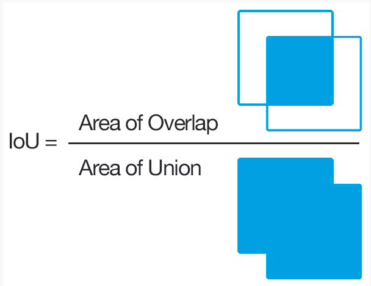

# Configuration
The robot work cell is showed in figure.1(整体安装示意图，安装反向，安装距离高度等)  
- The initial pose of the arm is **(1,1,1,1,1,1)**, angles of each joints. With this pose, the arm will not occlude the camera.    
- The end-effector is mounted on the with a **z offset** in the tool coordinate.
- The camera is mounted on the base and is **(xx,yy,zz)** in the robot base coordinate.
- The rectangle workspace is front of the robot, and the center is **(0,y,z)**, the width is 300mm, the lenth is 400mm. The left is place space and the right is pick space. 
- the objects are placed in the workspace, and the models(stl and png) are showed in **XXX** folder. 

In this example, the robot is UR5, the camera is realsense D435 and the end-effector is a suction cup.

# Procedure
With the same jigsaw puzzle, 3 tasks are implemented.
## pick and place task
task descrption
## 4-piece tiling task
task descrption
## 5-piece assembly task
task descrption

# Result
In each experiment, we record the results of the functions and task. The metrics of each function and full task are showed below.   
- IoU, Intersection over Union, an overlap ratio between the predicted bounding box and ground truth bounding box

**Recall**: TP/(TP+FN) = True position /(All real positive)   
**Precision**: TP/(TP+FP) = True position /(All predicted positive)

where TP is Ture positive, TN is True negative, FP is False positive,FN is False negative
- AP, The AP summarises the shape of the precision/recall curve, and is defined as the mean precision at a set of eleven equally spaced recall levels [0,0.1,...,1],here r is recall:

- success rate, this metric evaluates the physical performance of the picking, equals success picking/total picking.

- time, the time consumption of each period and the full task. This metric represent the of the action.

   

metrics|IoU|AP|success rate|time(s)|area rate
-------|---|--|------------|---------|----
-------|segmentaion|recognitation|pick plan|0.9|11.6

task1|IoU|AP|success rate|time(s)|area rate
-----|---|--|------------|---------|----
-----|0.8|0.8|0.9|0.9|11.6
