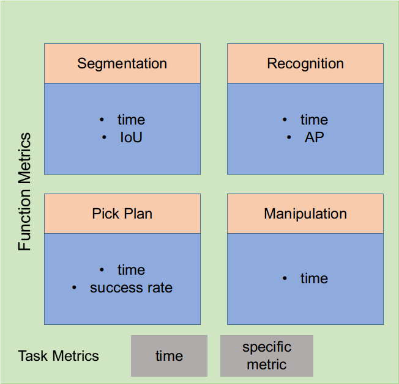
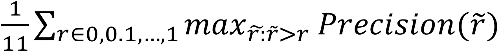

# Configuration
The robot work cell is showed in figure.1(整体安装示意图，安装反向，安装距离高度等)(一张俯视图，一张正视图，说明各个部分相互之间的位置关系)  
- The initial pose of the arm is **(1,1,1,1,1,1)**, angles of each joints. With this pose, the arm will not occlude the camera.    
- The end-effector is mounted on the with a **z offset** in the tool coordinate.
- The camera is mounted on the base and is **(xx,yy,zz)** in the robot base coordinate. The accurate position is got by calibration.
- The rectangle workspace is front of the robot, and the center is **(0,y,z)**, the width is 300mm, the lenth is 400mm. The left is place space and the right is pick space. 
- the objects are placed in the workspace, and the models(stl and png) are showed in **XXX** folder. 

In this example, the robot is UR5, the camera is realsense D435 and the end-effector is a suction cup.   
The configration of three tasks followed are similar, and the different is where and how to place the jigsaw pieces.

# Procedure
With the same jigsaw puzzle, 3 tasks are implemented.
## pick and place task
（增加初始状态示意图,一张初始，一张放置）4 pieces is placed on the **XXX space**, (将pick区域分成四块，四片分别放置在四个区域，这样使得整个任务运行的轨迹距离基本一致)(以放置区域中心为基点，4 block模板放在正中)
## 4-piece tiling task
task descrption (以放置区域中心为基点，完成拼图时，拼图中心与基点重合)
## 5-piece assembly task
task descrption (以放置区域中心为基点，拼图基板与中心重合)

# Result
In each experiment, we record the results of the functions and task. The metrics of each function and full task are showed below.   

Figure 3. Metrics
 

- **IoU**: Intersection over Union, an overlap ratio between the predicted bounding box and ground truth bounding box. To calculate this metric, we print jigsaw shape templates of each piece and place the jigsaw piece on the corresponding jigsaw shape template. We get the ground truth using templates,and calculate the IoU.

Figure 1. IoU
        

_Recall_: TP/(TP+FN) = True position /(All real positive)   
_Precision_: TP/(TP+FP) = True position /(All predicted positive)   
where TP is Ture positive, TN is True negative, FP is False positive,FN is False negative 
- **AP**: The AP summarises the shape of the precision/recall curve, and is defined as the mean precision at a set of eleven equally spaced recall levels [0,0.1,...,1],here r is recall:

Figure 2. AP
 

- **success rate**: this metric evaluates the physical performance of the picking, equals success picking/total picking.

- **time**: the time consumption of each period and the full task. This metric represent the cost of the task.
- **area rate**: standard area/real area

Figure 4. area rate
 

metrics|IoU|AP|success rate|time(s)|area rate
-------|---|--|------------|---------|----
-------|segmentaion|recognitation|pick plan|0.9|11.6

task1|IoU|AP|success rate|time(s)|area rate
-----|---|--|------------|---------|----
1|0.8|0.8|0.9|0.9|11.6
