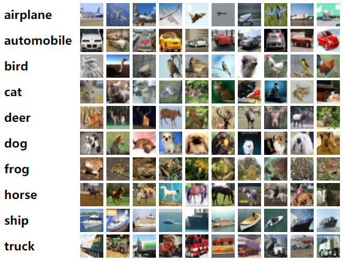

# [CIFAR](https://www.cs.toronto.edu/~kriz/cifar.html)
The CIFAR-10 and CIFAR-100 are labeled subsets of the 80 million tiny images dataset. They were collected by Alex Krizhevsky, Vinod Nair, and Geoffrey Hinton.

## The CIFAR-10 dataset
The CIFAR-10 dataset is a object classification image dataset. It consists of 60000 32x32 colour images in 10 classes, with 6000 images per class. There are 50000 training images and 10000 test images.

Figure 1. The classes in the dataset.

Each image only belongs to one class, multi-class is illegal in this dataset.

### Download
[CIFAR-10 python version](https://www.cs.toronto.edu/~kriz/cifar-10-python.tar.gz)

[CIFAR-10 Matlab version](https://www.cs.toronto.edu/~kriz/cifar-10-matlab.tar.gz)

[CIFAR-10 binary version (suitable for C programs)](https://www.cs.toronto.edu/~kriz/cifar-10-binary.tar.gz)

## The CIFAR-100 dataset
This dataset is just like the CIFAR-10, except it has 100 classes containing 600 images each.
### Download
[CIFAR-100 python version](https://www.cs.toronto.edu/~kriz/cifar-100-python.tar.gz)

[CIFAR-100 Matlab version](https://www.cs.toronto.edu/~kriz/cifar-100-matlab.tar.gz)

[CIFAR-100 binary version (suitable for C programs)](https://www.cs.toronto.edu/~kriz/cifar-100-binary.tar.gz)

## Reference
This tech report (Chapter 3) describes the dataset and the methodology followed when collecting it in much greater detail. Please cite it if you intend to use this dataset.

[Learning Multiple Layers of Features from Tiny Images](https://www.cs.toronto.edu/~kriz/learning-features-2009-TR.pdf), Alex Krizhevsky, 2009.
