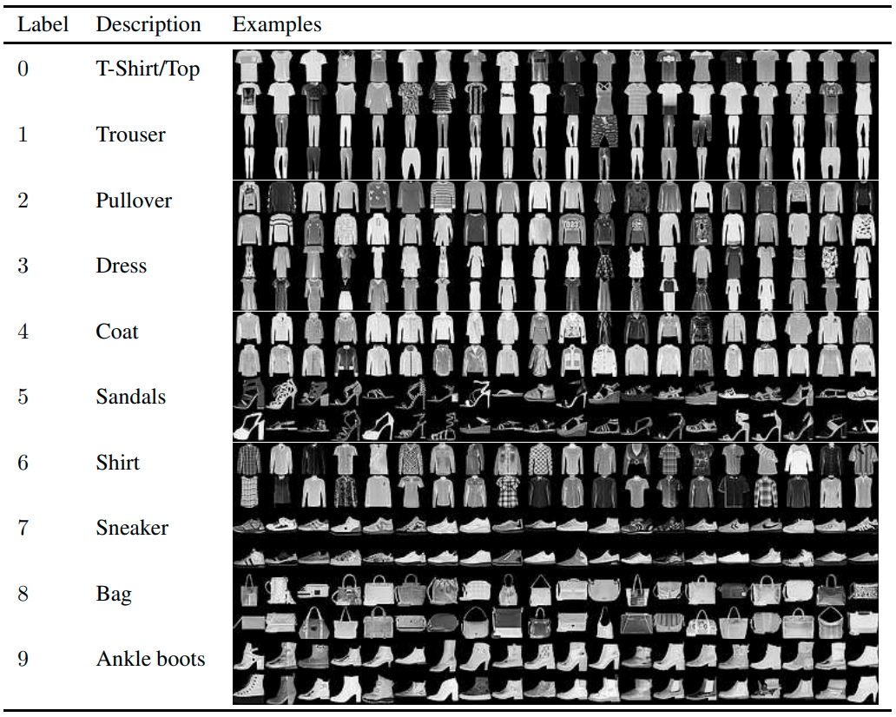

# Fashion-MNIST
 Fashion-MNIST is a fashion products data set from 10 categories,  consists of a training set of 60,000 examples and a test set of 10,000 examples. Go to the [github page](https://github.com/zalandoresearch/fashion-mnist#get-the-data) for more detailed information and downloading data set.

 

 
Figure 1. Dataset examples.

## Reference
Xiao H, Rasul K, Vollgraf R. [Fashion-mnist: a novel image dataset for benchmarking machine learning algorithms](https://arxiv.org/abs/1708.07747)[J]. arXiv preprint arXiv:1708.07747, 2017.
