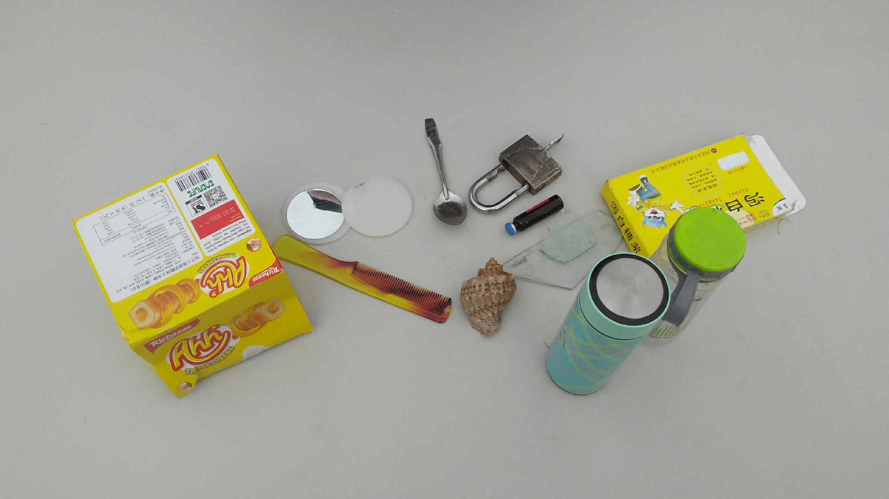
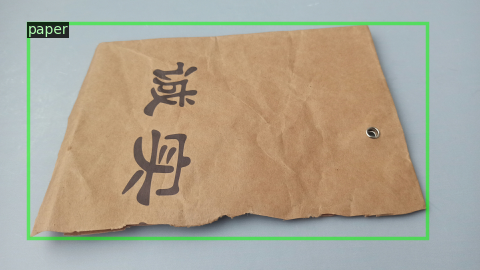
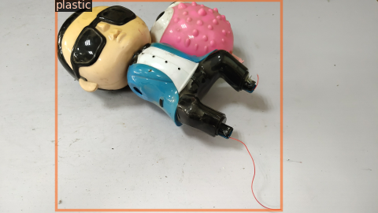

# BionicDL-CobotLearning-TrashSorting
The project is aimed to train a trash detector on four types of recyclable material including glass, paper, metal and plastics.

# Original Dataset
The Dataset used in this project is extract from the dataset provided by the 2020 Haihua AI Challange·Garbage Classification. Please visit the [website](https://www.biendata.com/competition/haihua_wastesorting_task2/data/) for more information on the competition.

The original training dataset provides 80,000 images containing a single type of trash in each image (simple data) and 2998 images containing multiple types of trashes (up to 20 types) in each image (complex data). Each image is 1920x1080 in size. The labels provide the bounding boxes and the corresponding classification labels. Beside, the competition also provides 10000 simple images and 1000 complex images containing multiple types of trashes for testing without labels. There are 204 classes of trashes in total.

The statistics of the simple data is summarized [here](./Original_Dataset_Statisttics.md).

Example images:




# Recyclable Dataset
Due to the size of the original dataset (180G simple data and 18G complex data), it is quite challenge to download the full dataset. Hence we extract part of the simple dataset which belong to the following four recyclable material: glass, paper, metal and plastics.

The recyclable dataset contains 14122 images of a single trash in each image. Images are resized to 960x540, which is half of the original resolution. There are four categories and the original category id is kept as category_id_ori in the label file. The labels are a list of dict as following

```
{"file_name": "train/images_withoutrect/27438.png",
 "image_id": 27438, "height": 540, "width": 960,
 "annotations": [{"bbox": [21.92, 31.22, 408.87, 204.44],
                  "bbox_mode": 1,
                  "category_id": 3,
                  "category_id_ori": 98,
                  "iscrowd": 0}]}
```

The details of each categories:

 - Glass:
```
  ['glass product', 'window glass', 'broken glass', 'cosmetic glass bottle', 'glass jars for food and daily necessities', 'glass']
```
 - Paper:
```
  ['journal', 'newspaper', 'food packaging box', 'shoe box', 'tetra pack', 'leaflets', 'printer paper', 'paper shopping bag', 'calendar', 'paper courier bags', 'envelope', 'cigarette case']
```
 - Metal:
```
  ['cans', 'metallica', 'magnet', 'aluminium product', 'metal bottles', 'metal tools', 'tin can', 'spoon', 'kitchen knife', 'fork', 'pot', 'metal chopsticks']
```
 - Plastic:
```
  ['plastic toy', 'mineral water bottle', 'plastic foam', 'plastic package', 'rigid plastic', 'disposable plastic dinnerware']
```
The following images show the bounding box and class label in each image.




