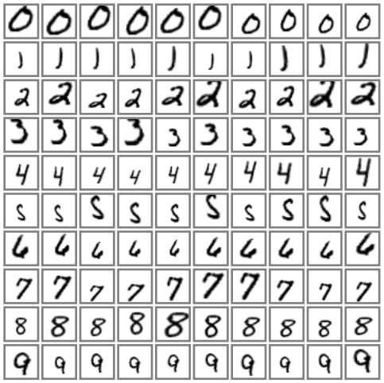

# [MNIST](http://yann.lecun.com/exdb/mnist/)
The MNIST database is a handwritten digits data set, has a training set of 60,000 examples, and a test set of 10,000 examples. The digits have been size-normalized and centered in a fixed-size image (28x28).

Download the database from http://yann.lecun.com/exdb/mnist/, and the example is showed in figure.1.

Figure 1. Dataset examples.

## Reference
LeCun Y, Bottou L, Bengio Y, et al. [Gradient-based learning applied to document recognition](http://www.dengfanxin.cn/wp-content/uploads/2016/03/1998Lecun.pdf)[J]. Proceedings of the IEEE, 1998, 86(11): 2278-2324.
