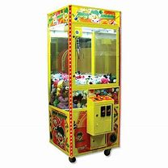

# Week 11 Introduction to DeepClaw

In week 11, students will learn the basic idea of Deepclaw. And then students are required to implement a smart claw machine in V-rep.

## DeepClaw basics

## Claw machine



You have to program your franka robot to claw the toys in front of the robot and put toy to a box next to robot.

Please use graspNet model in DeepClaw, this is a end2end model that take a 1280*720 image as input and output the best position and pose to pick.

'.ttt' Scene file was provide [here](../Simulation/scene/Claw_machine.ttt)

[Here](./Claw_machine_presentation_1.mp4) is a example of this project

### pipeline of main loop

```python
while True:
    # capture image and depth-image
    # extract the ros(Region of interest in img)
    # resize the ros to 1280*720
    # call Deeplearning algorithm here, get best position,pose and possibility

    # if best possibility < 80%
        #break
    
    # compute from u,v and depth-image to real world position 
    # robot move pipeline
```

### small hint

if you move the franka tip to the surface of toy, franka will always can't get the path, so you can elevate your gripper a little, don't worry the gripper can not grasp the object.
