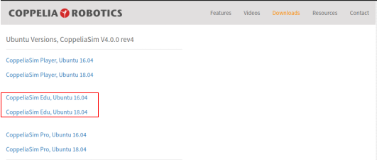

# Week 08 Introduction to CoppeliaSim (V-REP) and PyRep

In week 08, we will learn how to use CoppeliaSim and PyRep to complete your Project 1: Vision-guided Picking in PyRep.

The robot simulator CoppeliaSim, with integrated development environment, is based on a distributed control architecture: each object/model can be individually controlled via an embedded script, a plugin, a ROS or BlueZero node, a remote API client, or a custom solution. This makes CoppeliaSim very versatile and ideal for multi-robot applications. Controllers can be written in C/C++, Python, Java, Lua, Matlab or Octave.

PyRep is a toolkit for robot learning research, built on top of CoppeliaSim (previously called V-REP).

- [Week 08 Introduction to CoppeliaSim (V-REP) and PyRep](#week-08-introduction-to-coppeliasim-v-rep-and-pyrep)
  - [Install CoppeliaSim](#install-coppeliasim)
  - [Install PyRep](#install-pyrep)
  - [Project 1: Kinematic Picking in PyRep](#project-1-kinematic-picking-in-pyrep)

## Install CoppeliaSim

Dependency: Ubuntu; Python3.6 or higher; Git.

- Visit [CoppeliaSim download webpage](https://www.coppeliarobotics.com/ubuntuVersions).

- Click to download the *Edu* package depends on your system version(16.04 or 18.04)


- Extract the zip file into you home directory and you will have ~/CoppeliaSim_Edu_V4_0_0_Ubuntu16_04/

- Test: open terminal in the directory, then run the following command to open CoppeliaSim.

    ```bash
    cd ~/CoppeliaSim_Edu_V4_0_0_Ubuntu16_04
    ./coppeliaSim.sh
    ```

    If no warning occurs, you are ready to go! Press Ctrl+c in the terminal to exit CoppeliaSim.

## Install PyRep  

The students are suggested to create a new conda environment for PyRep.

```bash
conda create --name pyrep python=3.7
conda activate pyrep
# run the code to check if qt is installed under pyrep env.
# You should get nothing after running the following line. Otherwise, refer to the note to remove the qt under pyrep env
conda list | grep 'qt'
```

```bash
mkdir ~/git-projects
cd git-projects
git clone https://github.com/stepjam/PyRep.git
cd PyRep
```

Add the following to your ~/.bashrc file: (NOTE: Remember to edit the 'EDIT ME' in the first line)

```bash
export COPPELIASIM_ROOT=/home/EDIT ME/CoppeliaSim_Edu_V4_0_0_Ubuntu16_04
export LD_LIBRARY_PATH=$LD_LIBRARY_PATH:$COPPELIASIM_ROOT
export QT_QPA_PLATFORM_PLUGIN_PATH=$COPPELIASIM_ROOT
```

Remember to source your bashrc (source ~/.bashrc) after this.

Finally install the python library:

```bash
pip install -r requirements.txt
python setup.py install
```

You should be good to go! Try running one of the examples in the examples/ folder.

```bash
cd examples
python example_panda_reach_target.py
```

**Note:** You  might encounter the qt version problem. The CoppeliaSim uses its own qt library in its root folder. In case your system find other qt installation under anaconda, you need to remove that qt library and reinstall PyRep. Remember to remove the /build folder every time you want to reinstall PyRep. Refer to [this issue](https://github.com/stepjam/PyRep/issues/76).

You should see the following window pop out:


## Project 1: Kinematic Picking in PyRep

This project aims to build a robot arm with camera in simulation and complete a picking task based on pre-defined waypoints. Please go to the [Simulation](../Simulation) directory for the code and instructions.
