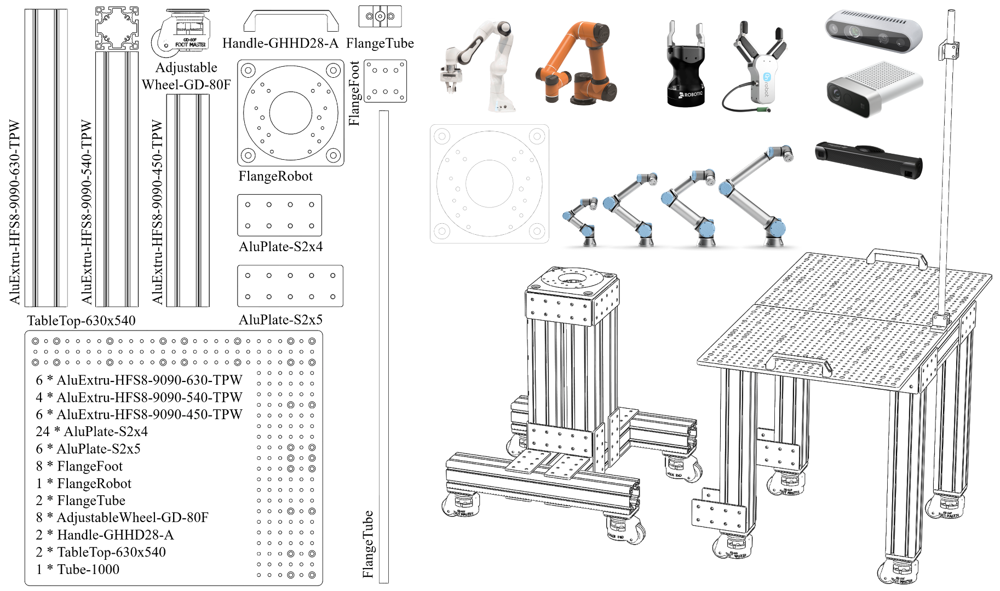
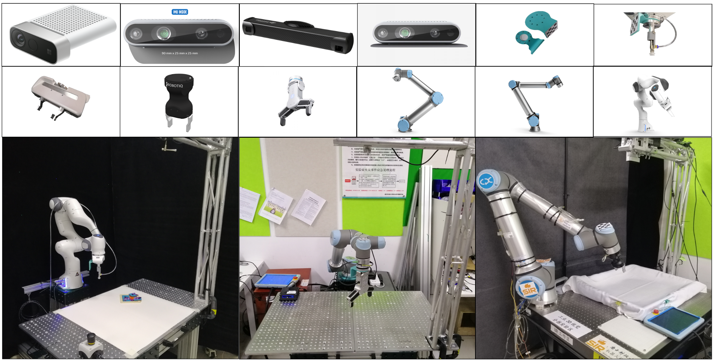

# DeepClaw Overview

## Design Notes

The DeepClaw is a benchmarking module pool that functions as a Reconfigurable Robotic Manipulation System for Robot Learning. Modern systems for robotic manipulation has gradually evolved to a common configuration of a cell station where multiple hardware and software are usually integrated to perform programmable tasks, such as object manipulation, human-robot interaction, and industrial collaboration. The challenge behind most manipulation-based robotic research and application is usually hidden by the growing complexity when integrating related hardware, such as manipulators, grippers, sensors, and environment with objects for manipulation, as well as software, such as algorithms, APIs, drivers, etc., towards a functional robot system. It is widely recognized among industrial robotics that the total cost of integration is usually at the same level as the price tage of the hardware itself, and may become even higher at many scenarios, where the market of robotic integration is actually slightly higher than the selling of robotic hardware itself.

For academic research, there are several alternative solutions before DeepClaw.

- **Commercial service providers for robotic integration**: This is a common solution that may require the least of effort at the beginning. But in the end, may not be suitable for research purpose at some point where further developement may not be possible or just too expensive.
- **Robot Operating System (ROS)**: The development of ROS contributed significantly to the growing adoption of robotic technologies in research and applications, which provides a standardized interface for communication among various robotic devices and software. However, the scope of the ROS is so broad with a relatively steep learning curve for most users, learners, and practioners to get started.
- **Do-it-yourself (DIY)**: This is also a common solution which usually starts with the dedicated software provided by the hardware supplier, or if the robotic device is developed by the research team from the ground up. With the growing adoption of collaborative robotic devices, the barrier of usage becomes much lower than before.

With a growing interest in robot learning, where learning-based methods are applied to robotic system to solve advanced manipulation tasks towards human-robot interaction. Several questions becomes imminent for researchers and practitioners:

- *Is there a "common" setup of robotic manipulation station?*
- *By what "standard" should I pick the specific hardware to build my robot learning station?*
- *Is there a "pipeline" of intergration so that I can get the system up-and-running and perform real-world experiment?*

While there is no "correct" answers to questions such as above, these challenges are commonly faced by many researchers already in this field, or have the interest to experiement with robot learning, which give birth to the development of DeepClaw. Based on the existing collection of robotic hardware at the [Bionic Design and Learning Lab](https://ancorasir.com/) at the [Southern University of Science and Technology](https://www.sustech.edu.cn/), we aim to develop a sharable and reproducible framework of Robot Manipulation System based on reviews of common setups of robot learning stations in recent research, aiming at building up a pool of hardware benchmarking system that facilitates a comparable metric for advanced robot learning algorithms, which is not yet explored in the current research (and also challenging).

DeepClaw is hardware-centric module pool towards a common design to benchmark robot stations through a Robotic Manipulation System, which involves a mechanical design of the DeepClaw Station, a growing collection of drivers that supports various robotic hardware, a cloud architecture that supports training and inference of robot learning experiments, and a collection of game objects for task representation.

## DeepClaw Station Design

After reviewing the robot station designs presented in several recent publications on robot manipulation learning, we proposed the following design using a standardized 9090 extrusion from global supplier such as Misumi and a few parts that can be easily machined by local machine shops to build up the system. The design can be accessed interactively through here. Feel free to contact us if you experience trouble sourcing the design, or have any suggestions to improve.

- **AluExtru**: 9090 series aluminium extrusion profiles from global supperlier such as Misumi.
    - Misumi Part#: HFS8-9090-630-TPW, HFS8-9090-540-TPW, HFS8-9090-450-TPW.
- **AluPlate**: simple design peg-hole style aluminium plate for reliable connection, can be easily machined by you local shop.
    - S2x4, S2x5.
- **FlangeX**: simple flange designs that supports heavy load connection, can be easily machined by your local shop.
    - FlangeRobot: Supports Franka, UR, and AUBO in one design, as of now.
    - FlangeFoot: Support the adjustable wheel.
    - FlangeTube: Support RealSense D400 series, as of now.
- **Others**: minimum accessories towards flexibility, robustness, and safety.
    - Tube: where cameras are mounted, can be easily modified based on your camera needs.
    - Handle (Part#: GHHD28-A): for ease of handling and safe usage.
    - Adjustable Wheel (GD-80F): for sturdiness and mobility.
    - TableTop (630x540): aluminium with CNC machined, threaded peg-holes, modify as you need.

## Supported Robotic Hardware

A reasonable range of robotic hardware is supported by DeepClaw, with further information explained in the [Robot Library](robot.md) section.

## Pipeline of Integration

The overall integration of DeepClaw is generally divided into four stages, with further information explained in the [DeepClaw Pipeline](pipeline.md) section.

## Server-Client Structure

In DeepClaw 2.0, we propose a new structure: the Server-Client Structure. This structure will benefit algorithm modules who require heavy computational resources by enabling GPUs in server.

More details can be found here.

- [how to add a new module in server]([])
- [how to create a related module in client]([])

## Publication

AIM 2020
