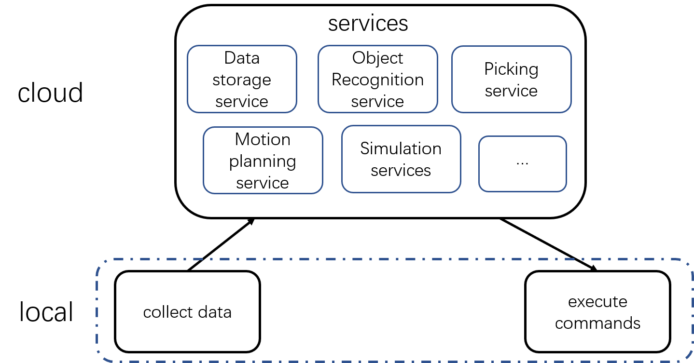
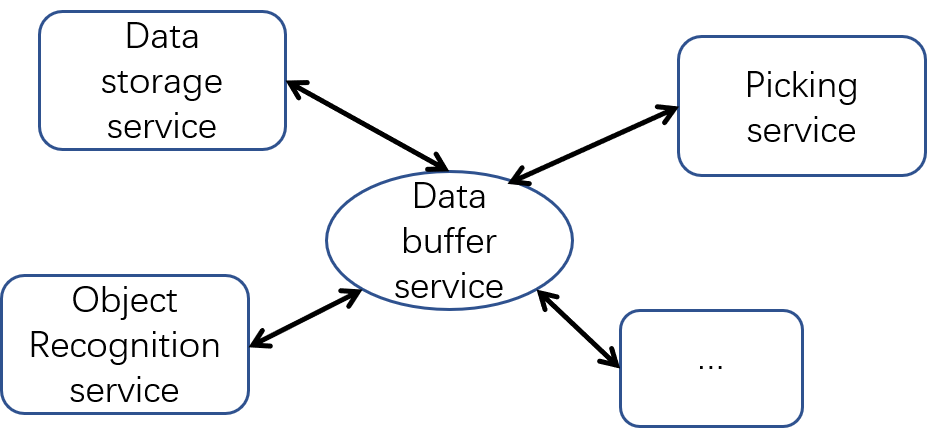

## Cloud Robotics
<!--
 A remote-brained robot is proposed in 2000 [2], and is the early conception of cloud robotics.
 -->
 The item “Cloud Robotics” is first proposed in 2010 by James Kuffner [6], and Cloud Robotics is a robot system that relies on either data or code from a network to support its operation, i.e., where not all sensing, computation, and memory is integrated into a single standalone system [4]. Separating hardware allow us to offload heavy computation of the robot, this makes it easy and cheap to deploy artificial intelligence applications on large-scale robots. The key technologies of cloud robotics are: big data, cloud computing, open source resources, cooperative robot learning, and network connectivity[5].

 Rapyuta [1] is a common cloud robotics platform, it supports 3000+ ROS packages and is easily extensible to other robotic middleware. Rapyuta focus on network connectivity and is open source (http://github.com/rapyuta/rce).

 “Robot Cloud Center” (RCC)[7] is a framework for multi-robot task scheduling and reusable services. In this framework, a complex service can be constructed from existing services.

 [8] use VirtualBox[9] to implement a cloud computing environment, and this environment where the user’s
applications run on servers directly connected to the resources manipulated by the application can avoid the delays by the slow internet connections and user’s computer limitations.

[10]

 Berkeley Robotics and Automation as a Service (BRASS) [3] use Dex-Net as a service on cloud, this is a specific robotic service for robotic grasping.

 现有的云机器人要么只关注通用平台，通讯机制；没有像我们这种有具体流程，可能兼容很多算法的云。

 平台评价维度： 可复用性，可拓展性

### Our Architecture
In our platform, we move all heavy computation in cloud, and remain only basic hardware drivers in local comuters. The local computer directly communicated with sensors, grippers, and arms; the cloud server has a much better perfoceman than local computers. This design not only reduces the network latency, and also reduces processing time.

Figure 1. The design of Service-Oriented Architecture.

### Virtualization
Docker is a set of platform as a service (PaaS) products that uses OS-level virtualization to deliver software in packages called containers.

We use Docker as the computing environment, and each service runs on a computing environment.

### Communication Between Services
We design a data buffer service for

Figure 2. Data exchange between services.

### Reference
[1] Mohanarajah G, Hunziker D, D'Andrea R, et al. Rapyuta: A cloud robotics platform[J]. IEEE Transactions on Automation Science and Engineering, 2014, 12(2): 481-493.

[2] Inaba M, Kagami S, Kanehiro F, et al. A platform for robotics research based on the remote-brained robot approach[J]. The International Journal of Robotics Research, 2000, 19(10): 933-954.

[3] Tian N, Matl M, Mahler J, et al. A cloud robot system using the dexterity network and berkeley robotics and automation as a service (brass)[C]//2017 IEEE International Conference on Robotics and Automation (ICRA). IEEE, 2017: 1615-1622.

[4] Kehoe B, Patil S, Abbeel P, et al. A survey of research on cloud robotics and automation[J]. IEEE Transactions on automation science and engineering, 2015, 12(2): 398-409.

[5] Wan J, Tang S, Yan H, et al. Cloud robotics: Current status and open issues[J]. IEEE Access, 2016, 4: 2797-2807.

[6] Kuffner J. Cloud-enabled robots in: Ieee-ras international conference on humanoid robots[J]. Piscataway, NJ: IEEE, 2010.

[7] Du Z, Yang W, Chen Y, et al. Design of a robot cloud center[C]//2011 Tenth International Symposium on Autonomous Decentralized Systems. IEEE, 2011: 269-275.

[8] Agostinho L, Olivi L, Feliciano G, et al. A cloud computing environment for supporting networked robotics applications[C]//2011 IEEE Ninth International Conference on Dependable, Autonomic and Secure Computing. IEEE, 2011: 1110-1116.

[9] VirtualBox Web site, www.virtualbox.org.

[10] Kehoe B, Matsukawa A, Candido S, et al. Cloud-based robot grasping with the google object recognition engine[C]//2013 IEEE International Conference on Robotics and Automation. IEEE, 2013: 4263-4270.
