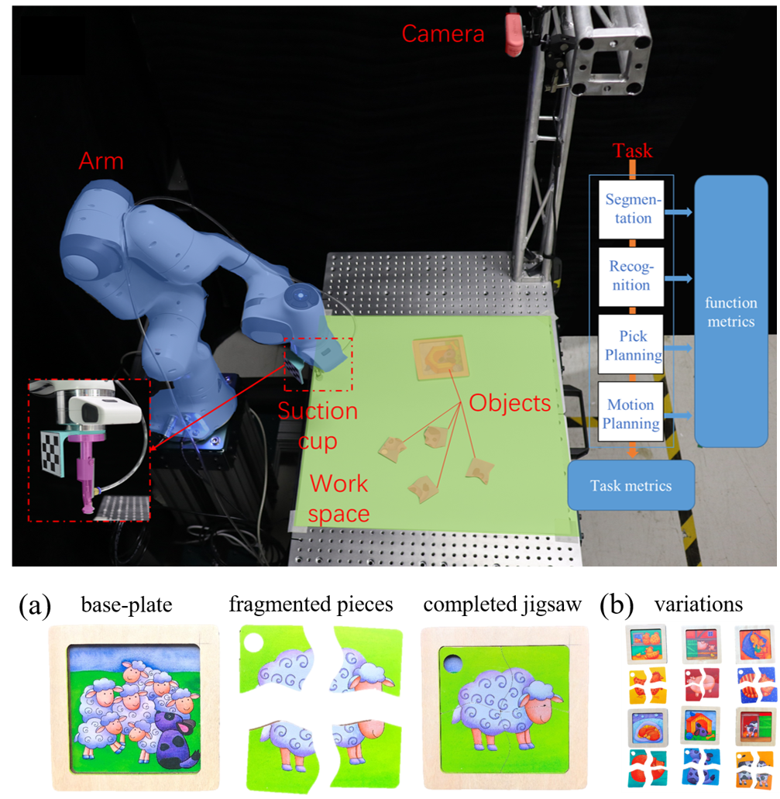
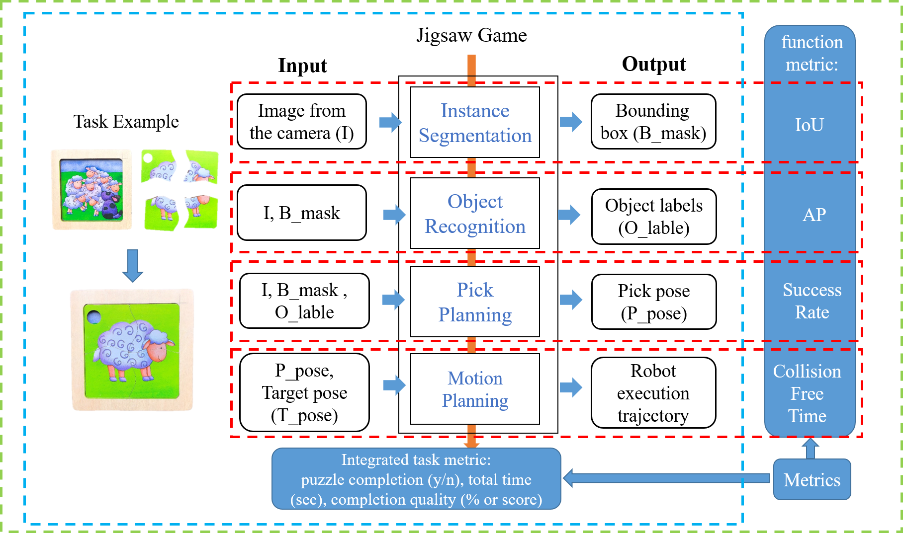
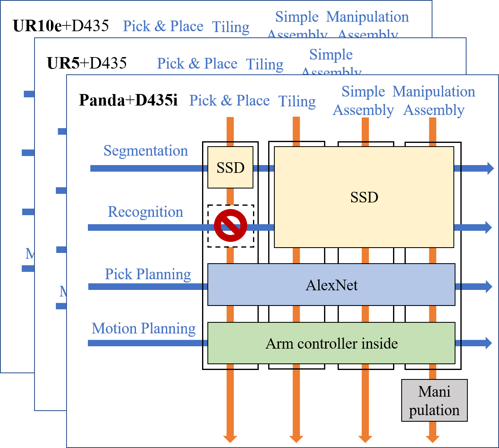
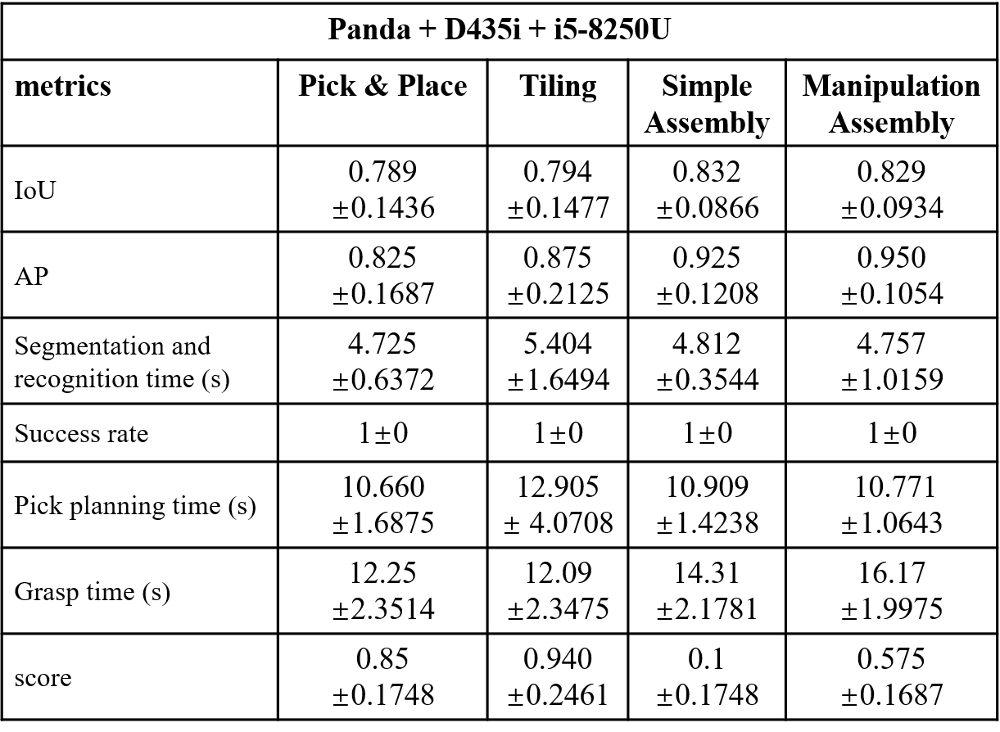

# Configuration
The robot work cell is showed in figure.1

Figure 1. The robot work cell
 

- Arm: A suction cup mounted on the tool flange, and the end of suction cup is 0.15 meters above the table, 0.3 meters away from the center of the workspace, and the pose is vertical downward.    
- The camera is mounted on the base and is 1m above the table. The accurate position is got by calibration.
- The rectangle workspace is front of the robot, the width is 300mm, the lenth is 400mm. 
- the jigsaw pieces are placed in the workspace. 

In this example, the robot is Franka Emika Panda, the camera is realsense D435i and the end-effector is a suction cup.   
The configration of three tasks followed are similar, and the different is where and how to place the jigsaw pieces.

# Procedure
With the same jigsaw puzzle, we proposed a standard workflow for manipulation task implementation. 

The functional metrics are general, and the full task metrics are designed according to actual tasks.

Figure 2. The workflow
 

We designed 3 tasks: pick and place task, 4-piece tiling task, 5-piece assembly task, and the details showed below:

Figure 3. The tasks sets
 

Tasks are also implemented in different platforms.

Figure 4. The hardware sets
 

# Result
In each experiment, we record the results of the functions and task. Each task we repeat 10 times, and the metrics of each function and full task are showed below.   

Table 1. an example of results
 

- **IoU**: Intersection over Union, an overlap ratio between the predicted bounding box and ground truth bounding box. To calculate this metric, we print jigsaw shape templates of each piece and place the jigsaw piece on the corresponding jigsaw shape template. We get the ground truth using templates,and calculate the IoU.       

　　_Recall_: TP/(TP+FN) = True position /(All real positive)   
　　_Precision_: TP/(TP+FP) = True position /(All predicted positive)   
　　where TP is Ture positive, TN is True negative, FP is False positive,FN is False negative 

- **AP**: True position /(All predicted positive). For this task, we predict all the object in the **ws space**, and judge which is right. For example, we predict 4 objects, and 3 is correct, so precision equals 3/4.

- **success rate**: this metric evaluates the physical performance of the picking, equals success picking/total picking.

- **time**: the time consumption of each period and the full task. This metric represent the cost of the task.
- **area rate**: standard area/real area

Figure 5. area rate
 

<!-- You can not see the following comment. -->
<!--
For each task, we repeat 10 times and record the results. And finilally calculate the result.

trial|IoU|seg time|precisiom|recog time|success rate|pick plan time|area rate|time(s)
:-----:|---|--------|--|----------|------------|--------------|------------|-------
1|0.8|12.3|4/5|4.0|2/3|8.0|0.9|40.3
2|---|--------|--|----------|------------|--------------|------------|-------
...|---|--------|--|----------|------------|--------------|------------|-------
12|---|--------|--|----------|------------|--------------|------------|-------
reault|IoU = sum(IoUi)/10|sum(timei)/10|sum(APi)/10|sum(timei)/10|sum(success ratei)/10|sum(timei)/10|sum(area ratei)/10|sum(timei)/10
-->

# Demo Videos
The whole video is here [video]("https://github.com/bionicdl-sustech/DeepClawBenchmark/tree/master/documents/Jigsaw_task/")

# Contact
If you have any questions or find any bugs, please let me know: 11930807@mail.sustech.edu
