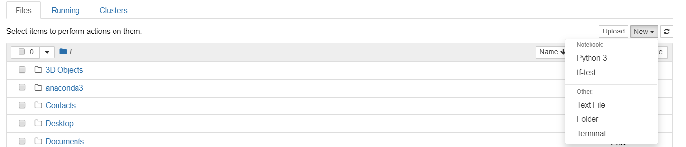

# ME336-Wk06-Lab: Software Preparation
In today's lab session, we will cover Python basics with Ubuntu installation as an optional step.

- Python basics: 
  - You can refer to the following page for a quick instruction. 
  - You can also refer to this link by [MIT DUSPviz](http://duspviz.mit.edu/tutorials/python_pandas/) for a quick tutorial. (Note that the Python tutorial link given in this tutorial is based on Python 2.0)
  - I would recommend the tutorial by [Python](https://docs.python.org/3.6/tutorial/) and [Google](https://developers.google.com/edu/python/) as the main content for today's class. (Make sure you are using Python 3.6)
- Ubuntu Installation (Optional): 
  - Optionally, you can follow [a few steps](https://github.com/ancorasir/DesignAIR-ME336/blob/master/projects-ME336/week06/how_to_install_ubuntu16.04.md) to install Ubuntu 16.04 on your laptop. Always back up first, and it would be very helpful later with the simulation and computation part. All lab content of ME336 has NOT been tested with Windows :(

# How to install anaconda

Anaconda is the easiest way to perform Python/R data science and machine learning on Linux, Windows, and Mac OS X. With over 19 million users worldwide, it is the industry standard for developing, testing, and training on a single machine, enabling individual data scientists to:
- Quickly download 7,500+ Python/R data science packages
- Manage libraries, dependencies, and environments with Conda
- Develop and train machine learning and deep learning models with scikit-learn, TensorFlow, and Theano
- Analyze data with scalability and performance with Dask, NumPy, pandas, and Numba
- Visualize results with Matplotlib, Bokeh, Datashader, and Holoviews

[Download](https://repo.anaconda.com/archive/) anaconda form ``https://repo.anaconda.com/archive/``, choose the operating system and version. Here we download [Anaconda3-5.2.0-Linux-x86_64.sh](https://repo.anaconda.com/archive/Anaconda3-5.2.0-Linux-x86_64.sh) for Linux and [Anaconda3-5.2.0-Windows-x86_64.exe](https://repo.anaconda.com/archive/Anaconda3-5.2.0-Windows-x86_64.exe) for Windows. The version of python in this anaconda version is python3.6.5, and more details about the version can be found in [release notes](https://docs.anaconda.com/anaconda/reference/release-notes/).

Note: if the python version of your anaconda is not python3.6, you can use ``conda create -n your-env-name python=3.6`` to create a python3.6 environment.

The ananconda installation is followed:
- [Windows](https://docs.anaconda.com/anaconda/install/windows/)
- [linux](https://docs.anaconda.com/anaconda/install/linux/)

## How to manage your packages
After installing the anaconda, we use [conda](https://docs.conda.io/en/latest/) to manage the packages.

In Windows, we open anaconda prompt; in Linux, we open terminal. Then type commands in the windows to create an environment and install packages.
Some conda commands are shown below:
```
  List the environments in the conda:
  > conda env list   

  Create a new environment:
  > conda create --name target-env-name
  > conda create -n target-env-name --clone src-env-name   

  Delete environment:
  > conda remove -n target-env-name --all

  Activate/deactivate environment:
  > conda activate target-env-name   
  > conda deactivate target-env-name

  Install packages:
  > conda install target-package   
  > conda install target-package=version

  List the packages installed:
  > conda list

  Remove the packages:
  > conda remove target-package
```

## Environment in Jupyter Notebook
Export your conda environment to [Jupyter Notebook](https://jupyter.org/).
```
> conda activate target-env-name
> conda install ipykernel
> python -m ipykernel install --user --name target-env-name --display-name "name_showed_in_jupyter"
```
open Jupyter Notebook, and choose the environment.
<p align="center"></p>
<p align="center">Choose the environment you used</p>

Now, you can start your program. And you can follow the online [tutorials](https://www.tutorialspoint.com/jupyter/).

## Python
The official tutorial is [here](https://docs.python.org/3/tutorial/index.html), and a quick start is [here](https://www.liaoxuefeng.com/wiki/1016959663602400).


# TensorFlow Installation
As [TensorFlow](https://pytorch.org/get-started/locally/#windows-anaconda)=2.x is not available from conda, we use pip to install it.
> ``pip install tensorflow==2.0``
> #if it's too slow, use other source like below    
> ``pip install tensorflow==2.0 -ihttps://pypi.tuna.tsinghua.edu.cn/simple/``

<!--
For [PyTorch](https://pytorch.org/get-started/locally/#windows-anaconda),
>conda install pytorch torchvision cpuonly -c pytorch   
>
>conda install pytorch torchvision cudatoolkit=10.1 -c pytorch
-->
