The following is tested with a Xiaomi Notebook. The steps should be similar to your laptop. Always back up files before doing the installation.

# Before installation
First, we need to ensure that the computer has space for the Ubuntu installation. Go to computer management (right-click computer). Right-click the C disk and choose the compress.   

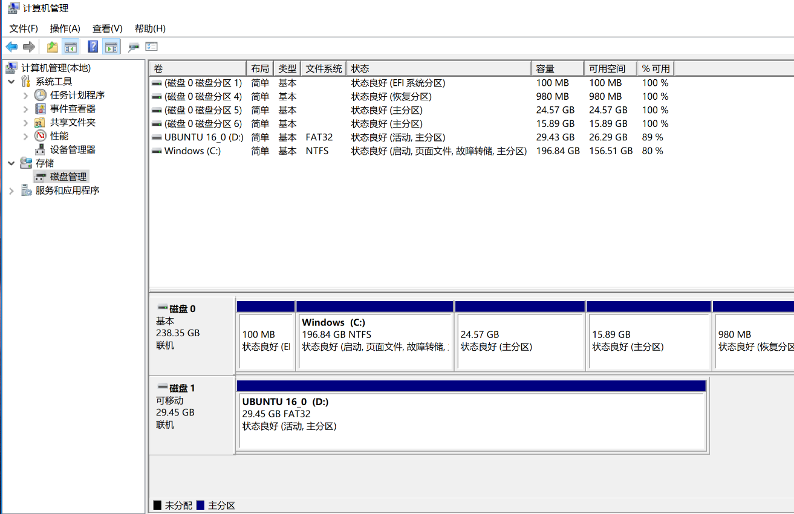

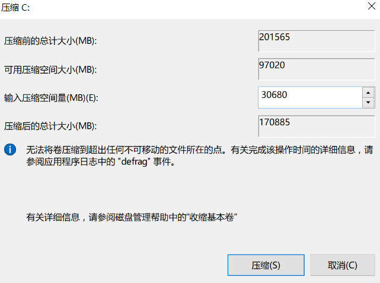

Then we need to compress a minimum of 20GB to 30GB for the installation. As we need to do our projects in Linux, 100GB, or more is better if allowed.

Then we need to set BIOS. Restart the computer, keep on pressing F2 to enter the following interface.

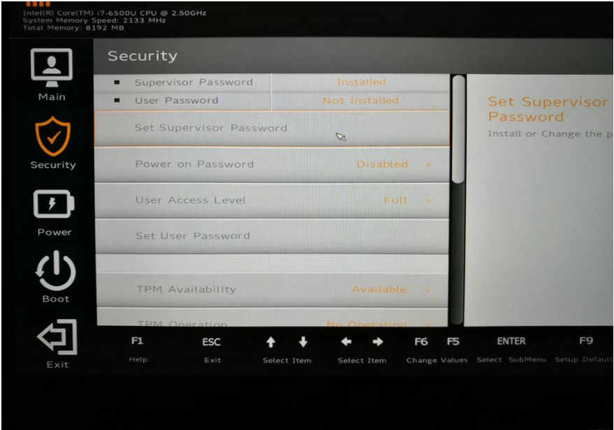

Then Security: Set Supervisor password.

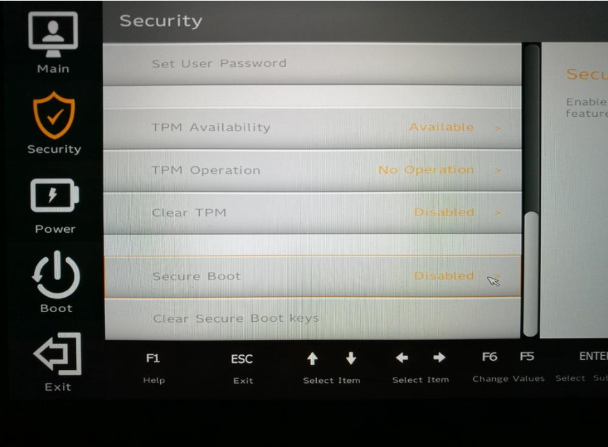

Security:  Secure Boot: Disabled

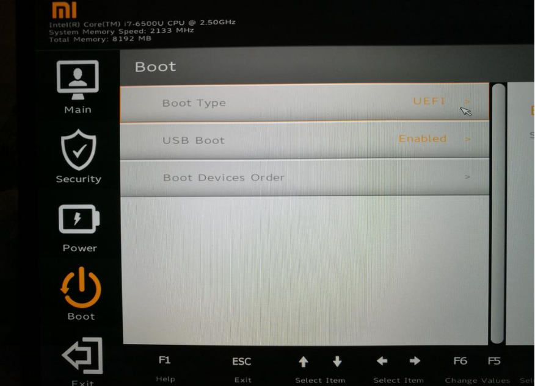

Boot: Boot type: UEFI
Then press F10 and Enter to restart the computer.    
Then press F12 to enter a similar interface and choose your USB.

# Ubuntu installation
Then enter the USB drive installation interface. Choose “install Ubuntu.”

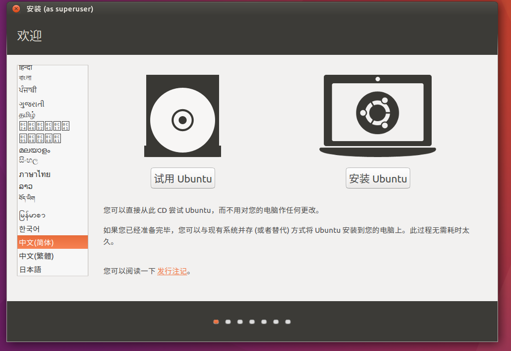

We can either choose Chinese or English as we can. Then select the install Ubuntu.   
Then we can choose the Wi-Fi according to your own computer situation.    
Then check the second option and continue. If your network speed is fast, the first option can also be ticked.   

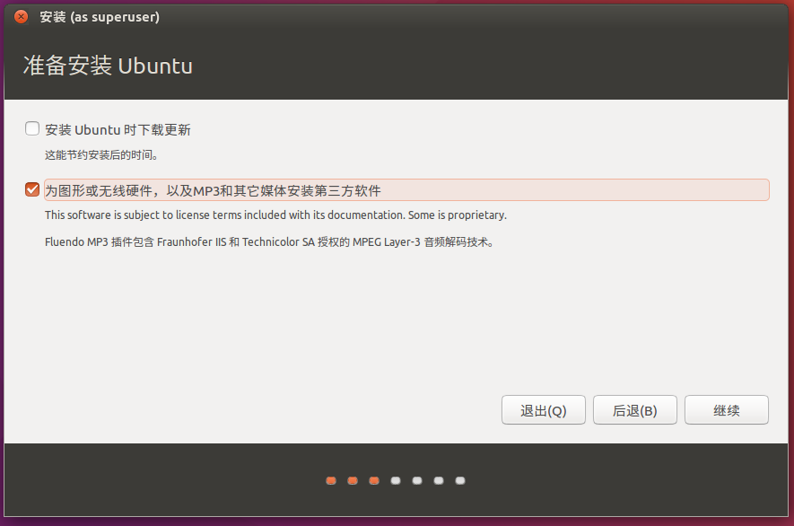

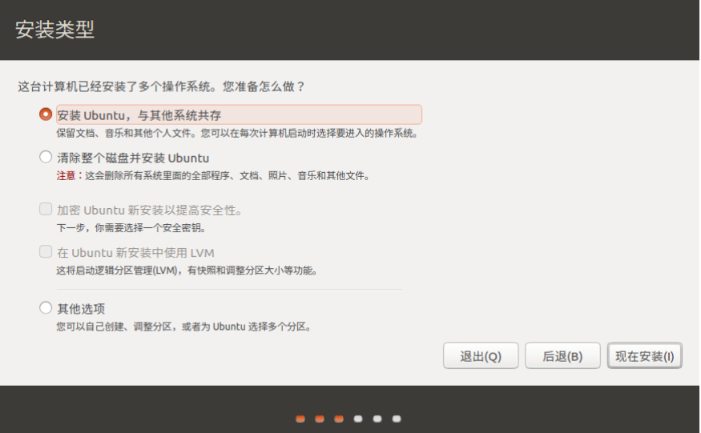

When the windows system exists, it will default to use the unallocated part of the space to install Ubuntu. Then we continue, and we will see:

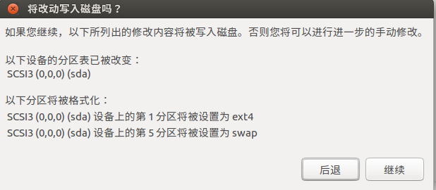

Choose to continue.

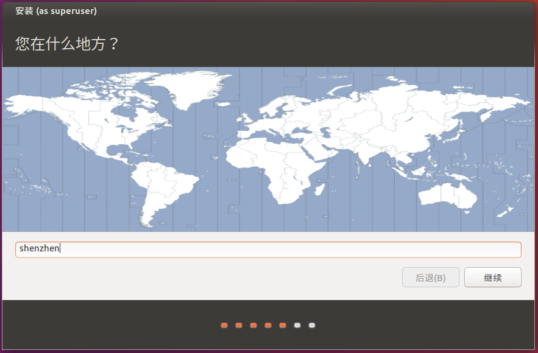

Then input your position and continue.

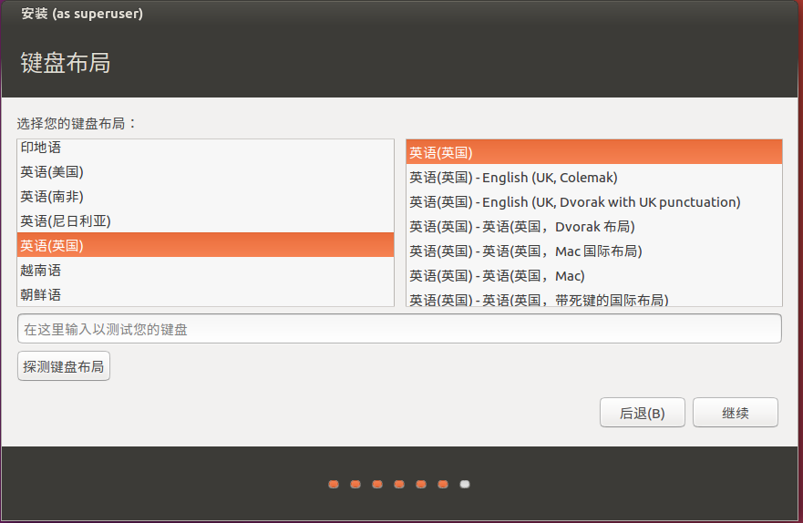

We can choose either Chinese or English according to your preference.     
Then input your personal information:

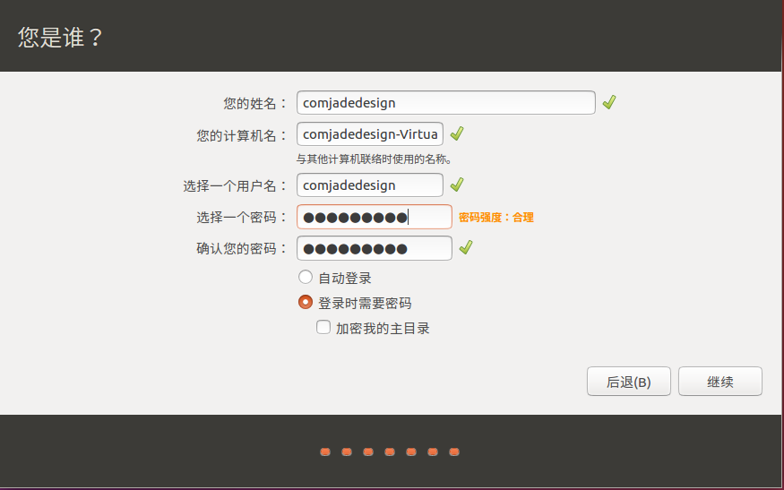

Now, wait until the installation finish.

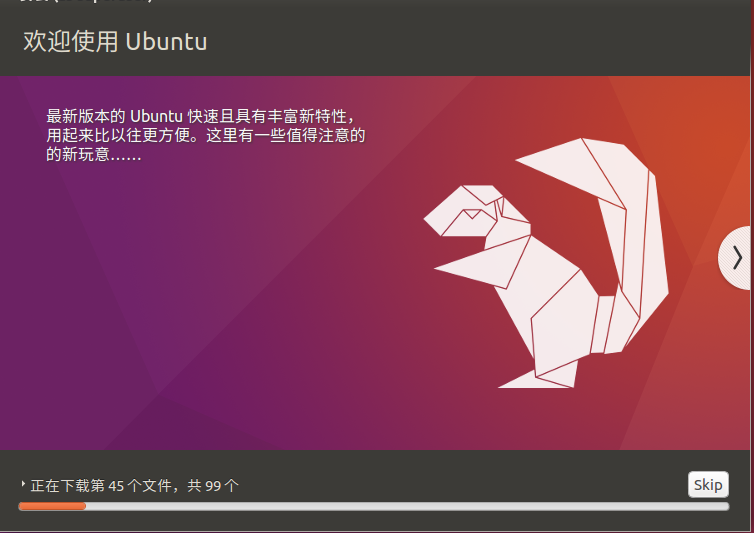

Then restart your computer.

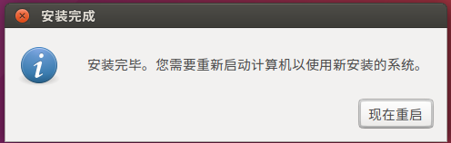

Then remove your USB and press enter.

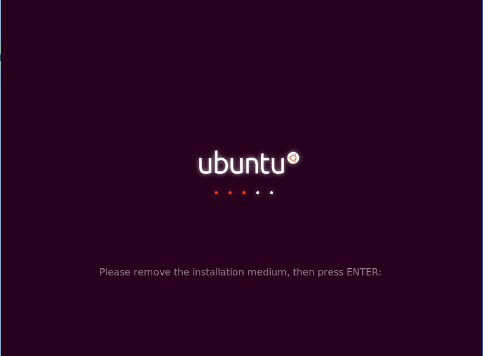

Input your password and enter Ubuntu.

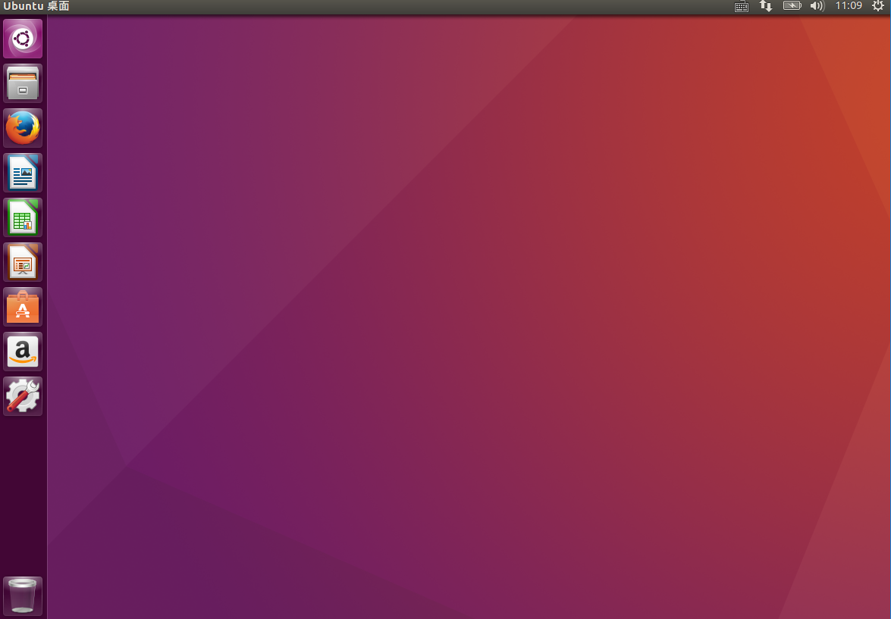
