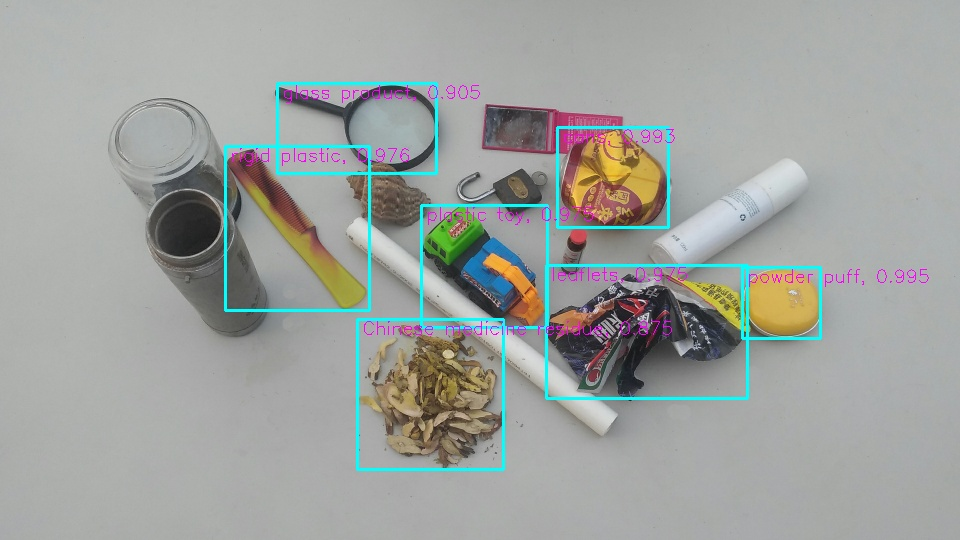

# Robot Learning for Trash Sorting

## Research Question
- How can we learn from public trash datasets to design a robotic manipulation system for automated trash sorting?
  -  Can we learn from public trash datasets
  -  How to design a robotic manipulation system
  -  To what extent, can we generalize for automated trash sorting

- Targets?
  - robotic manipulators for automated trash sorting
  - robot learning from a big dataset of trash sorting
  - challenges in system integration

## Training A Waste Detector

### Dataset
The Dataset used in this project is from the dataset provided by the 2020 Haihua AI Challange·Garbage Classification. Please visit the [website](https://www.biendata.com/competition/haihua_wastesorting_task2/data/) for more information on the competition.

The training dataset provides 80,000 images containing a single type of trash in each image (simple data) and 2998 images containing multiple types of trashes (up to 20 types) in each image (complex data). Each image is 1920x1080 in size. The labels provide the bounding boxes and the corresponding classification labels. Beside, the competition also provides 10000 simple images and 1000 complex images containing multiple types of trashes for testing without labels. There are 204 classes of trashes in total.

### The Efficientdet model
As a baseline, we trained the newly published efficientdet with the waste sorting dataset. Efficientdet is a state of the art object detector, which has been integrated in DeepClaw using pytorch framework. The model is modified from [this repository](https://github.com/zylo117/Yet-Another-EfficientDet-Pytorch) and is placed [here](../../deepclaw/modules/end2end/efficientdet/). The the sake of demostration, we trained the simplest efficient-D0 with the complex data of 2998 images.

### Get Started to train
The training is done with a Nvidia V100 GPU on a DGX station. The training code is run in a docker with python 3.7 and pytorch 1.5. Download the pretrained weights on COCO [efficientdet-d0.pth](https://github.com/zylo117/Yet-Another-Efficient-Pytorch/releases/download/1.0/efficientdet-d0.pth) and run the following script. The finetuned weights will be saved under efficientdet/weights/complex/

``` bash
cd DeepClawBenchmar/deepclaw/modules/end2end/efficientdet
python train.py -c 0 --batch_size 2 --num_workers 2 \
 --lr 1e-5 \
 --num_epochs 50 \
 --project complex \
 --type complex \
 --save_interval 1500  --saved_path weights \
 --load_weights weights/efficientdet-d0.pth 
 ```

### Get Started to inference
The inference api is provided in efficientdet_predictor.py and efficientdet_predictor_client.py. The former is used to run the inference on a local machine and the latter is for inferencing on a remote server. Please go to the [website](https://bionicdl-sustech.github.io/DeepClawBenchmark/) for a detailed instruction on how to run inference on server.

A demo of inferring the images under deepclaw/modules/end2end/efficientdet/test/* can be run by
```bash
python demo.py
```


 ## Automatic Waste Sorting

 ### Task pipeline definition
 The taks pipleline is defined in [trash_sorting.py](./trash_sorting.py). The segmentation and recognition steps are combined and given by the output of efficientdet. The detected box with the highest score is selected to be picked first.
 
 For the grasp planning, we alway grasp at the center of the detected bounding box.The gripper keeps vertical and rotates 0 or 90 degrees around z axis according to the shape of the detected bounding box. Since the gripper is a two fingers type, this stratedge is simple and good enough to grasp all the tested objects.

 For the motion planning step, we use predefined waypoints above the grasp position and approach the object from above. 

 ### Get Started to pick
 The main function main.py contains the codes to connect all the hardware, run the detection and execute the grasp. We use a laptop with Nvidia GTX 1060 GPU card to run the detector. Make sure to connect the D435 camera and the UR10e to your PC and switch UR10e to remote control beofore running the following script.

 ``` bash
 python main.py
 ```